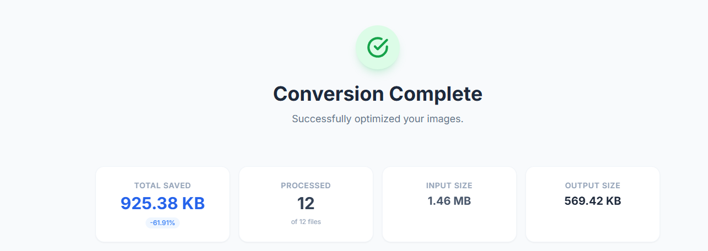
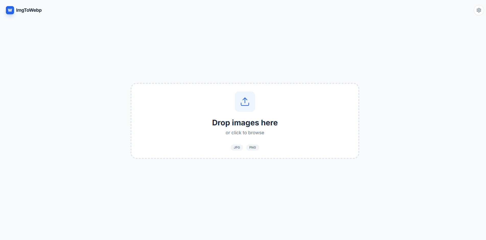

# imgtowebp

[English](README.md) | 中文

一个简单易用的图片转 WebP 格式工具，支持命令行和 Web UI 两种使用方式。



## 功能特性

- 🖼️ 支持批量转换 JPG/JPEG/PNG 图片为 WebP 格式
- 📦 支持递归扫描子目录
- 🎨 可自定义质量参数（0-100）
- 🌐 提供 Web UI 界面，支持拖拽上传
- 💾 可选择是否覆盖已存在的 WebP 文件
- 🗑️ 支持转换后删除原始图片
- 📊 显示转换统计信息和文件大小优化情况

## 安装

### 方式一：从源码安装

```bash
# 克隆仓库
git clone <repository-url>
cd imgtowebp

# 安装依赖
pip install -r requirements.txt

# 安装包（可选，安装后可使用命令行工具）
pip install .
```

### 方式二：直接使用（无需安装）

确保已安装依赖：

```bash
pip install Pillow Flask werkzeug
```

## 使用方法

### 命令行模式 (CLI)

#### 基本用法

```bash
# 转换当前目录下的所有图片
python main.py

# 转换指定目录
python main.py --dir ./images

# 设置质量参数（0-100，默认 80）
python main.py --dir ./images --quality 90

# 只扫描当前目录，不递归子目录
python main.py --dir ./images --no-recursive

# 覆盖已存在的 WebP 文件
python main.py --dir ./images --overwrite

# 转换后删除原始图片
python main.py --dir ./images --replace
```

#### 安装后使用命令行工具

如果已通过 `pip install .` 安装，可以直接使用：

```bash
imgtowebp --dir ./images --quality 85
```

### Web UI 模式

#### 启动 Web 服务器

```bash
# 使用默认配置（127.0.0.1:5000）
python main.py web

# 指定端口
python main.py web --port 8080

# 指定输出目录
python main.py web --output-dir ./webp_output

# 指定主机和端口
python main.py web --host 0.0.0.0 --port 5000
```

#### 直接运行 Web 应用

```bash
python src/imgtowebp/web/app.py --port 5000
```

#### 安装后使用 Web 工具

```bash
imgtowebp-web --port 5000
```

#### Web UI 功能

- 支持拖拽或点击上传多个图片文件
- 可设置质量参数（0-100）
- 可指定输出子目录
- 可选择是否覆盖已存在的文件
- 显示转换结果和统计信息



访问 `http://localhost:5000` 使用 Web UI。

## 命令行参数说明

### CLI 模式参数

- `--dir DIR`: 目标目录（默认：当前目录）
- `--quality QUALITY`: WebP 质量 0-100（默认：80）
- `--no-recursive`: 不递归扫描子目录
- `--overwrite`: 覆盖已存在的 WebP 文件
- `--replace`: 转换后删除原始图片文件

### Web 模式参数

- `--host HOST`: 服务器主机地址（默认：127.0.0.1）
- `--port PORT`: 服务器端口（默认：5000）
- `--output-dir OUTPUT_DIR`: 输出目录（默认：webp_output）

## 项目结构

```
imgtowebp/
├── src/
│   └── imgtowebp/
│       ├── __init__.py
│       ├── core.py          # 核心转换逻辑
│       ├── cli.py           # 命令行工具
│       └── web/             # Web UI
│           ├── app.py       # Flask 应用
│           ├── static/      # 静态资源
│           └── templates/  # HTML 模板
├── docs/
│   └── assets/
│       └── screenshots/    # 项目截图
├── main.py                  # 统一入口
├── pyproject.toml           # 项目配置
├── requirements.txt        # 依赖列表
└── README.md              # 说明文档
```

## 依赖要求

- Python >= 3.8
- Pillow >= 9.0.0
- Flask >= 2.0.0
- werkzeug >= 2.0.0

## 示例

### 批量转换并删除原图

```bash
python main.py --dir ./photos --quality 85 --replace
```

### 启动 Web 服务器供局域网访问

```bash
python main.py web --host 0.0.0.0 --port 8080
```

### 转换输出示例

```
Converted: photo1.jpg -> photo1.webp
Converted: photo2.png -> photo2.webp
Deleted original: photo1.jpg

Summary:
  Scanned files: 10
  Eligible images: 2
  Converted: 2
  Skipped (existing webp): 0
  Deleted originals: 2
  Failed: 0
  Total size before (converted): 5.23 MB
  Total size after  (webp):      3.45 MB
  Saved: 1.78 MB (34.05%)
```

## 贡献

欢迎提交 Issue 和 Pull Request！
